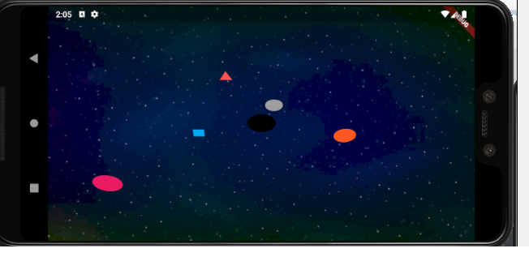

# galaxy

Galaxy App

## Description

This project is for the screening test by mokuteki.io

the planets revolve around a black hole in the center of the screen.
planets speed is determined by the distance from the planet of the black hole

there are few planets appear from the corner of the screen and straight to the black hole,
the 3d rotation on X-axis caused the straight line to be curved.

testing result

mobile landscape

mobile portrait

tablet landscape

tablet portrait

